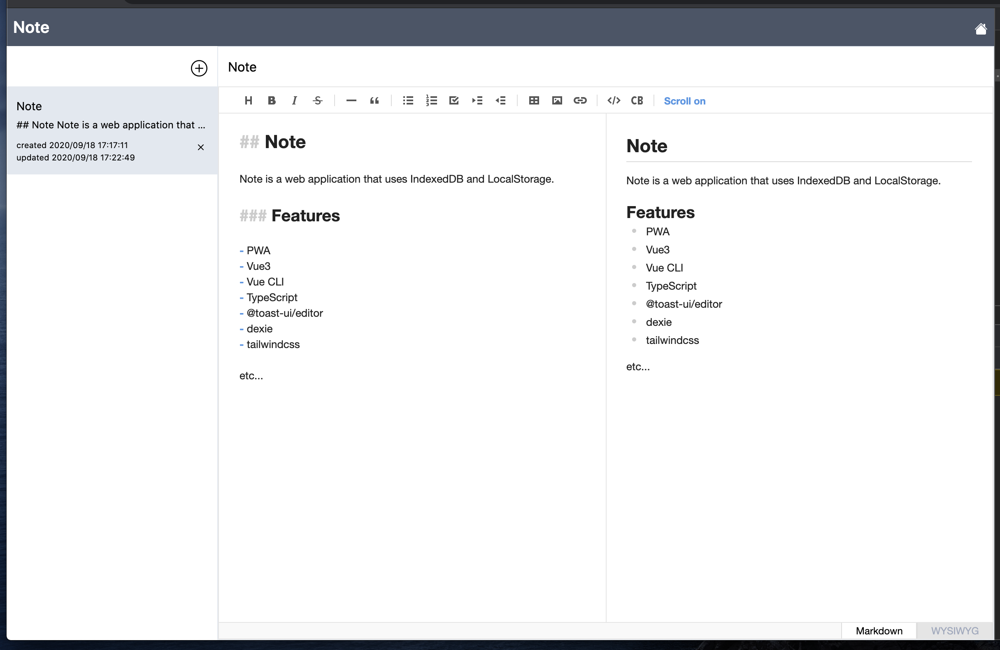

# Note

Note is a web application that uses **IndexedDB** and **LocalStorage**.


## Features

- PWA (Desktop)
- Vue3
- Vue CLI
- TypeScript
- @toast-ui/editor
- dexie
- tailwindcss

etc...



## Project setup
```
npm install
```

### Compiles and hot-reloads for development
```
npm run serve
```

### Compiles and minifies for production
```
npm run build
```

### Run your unit tests
```
npm run test:unit
```

### Run your end-to-end tests
```
npm run test:e2e
```

### Lints and fixes files
```
npm run lint
```

### Customize configuration
See [Configuration Reference](https://cli.vuejs.org/config/).
